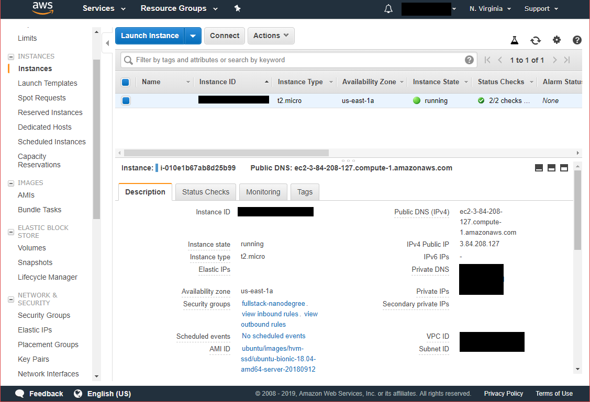
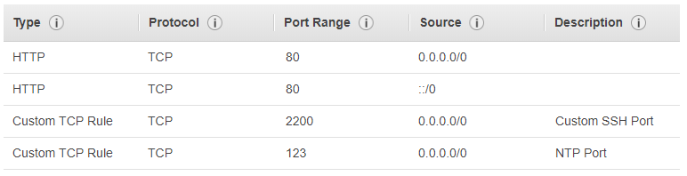

# Fullstack Catalog Server Documentation

This document describes how my [Python/Flask + PostgreSQL project](https://github.com/miguelrincon/fullstack-nanodegree-catalog) was setup AWS Ubuntu Server.

It aims to fullfill the **Linux Server Configuration** project rubric in: 
https://review.udacity.com/#!/rubrics/2007/view

## Server location

The website can be visited at:

> http://ec2-3-84-208-127.compute-1.amazonaws.com

Public IP address:

> 3.84.208.127

Opened SSH port:

> 2200

## Server description

The server is a EC2 `t2.micro` created in the N. Virginia data center, AWS Lightsail was not used so I could use the Free tier of EC2.



I setup the server with its own simple security group, to allow access on HTTP, NTP, and custom SSH port 2200. Blocking all other incoming traffic.



## Server configuration

1) Install new packages:

Initially I could not install using apt-get, So I had to update the `sources.list` file.

```
sudo sed -i 's/us-east-1\.ec2\.//g' /etc/apt/sources.list
```

After this, I installed apache2, python3, ...

2) Configuration of SSH and UFW firewall to allow traffic over SSH.

2) Git clone the catalog project.

I got the project source code. Installed dependencies using requirements.txt.

3) Configuration of apache

Change the permisssions of /var/html/www directory.

4) I configured the PostgreSQL user: `catalog` and its permissions

5) I tried to run the database migration! Some trial and error was required to make the original code work:

- I changed paths to config files setup as absolute. WSGI doesn't understand the project location.


6) Run the project (a bit more trial and error)

- Created of an additional `.wsgi` file which returns an `application` variable to be able to run the project.
- Update my Github App (used for OAuth) parameters, most importanlty, the URL of the application.

## List of third-party resources and documentation

The part that gave me most trouble during setup was the WSGI + Apache configuration on Python 3.

- The [mod_wsgi documentation](https://modwsgi.readthedocs.io/en/develop/configuration.html) allowed me to undestand the background of wsgi and it's configuration parameters.
- The [Pip mod_wsgi](https://pypi.org/project/mod_wsgi/) installation instructions helped me install WSGI without having to compile a new wsgi for my version of Python (3.6).
- [This SO answer](https://stackoverflow.com/a/31564325/777539) gave me the clue that WSGI installation had to be done differently for Python 3 than the default instructions.

Other documentation that helped:

- For some reason, AWS Ubuntu machines have a `sources.list` file with Amazon repositories that yield 404. [This fix](https://askubuntu.com/a/382452/672456) helped.
- [Requirements files documention](https://pip.pypa.io/en/stable/user_guide/#requirements-files) to install the same versions of packages consistently from local to server.

## Opportunities for improvement

- Use `virtualenv` to setup the project dependencies, which is considered a best practice. I installed `requirements.txt` globally to Python 3.
- HTTPS/SSL should be added to make the application secure.